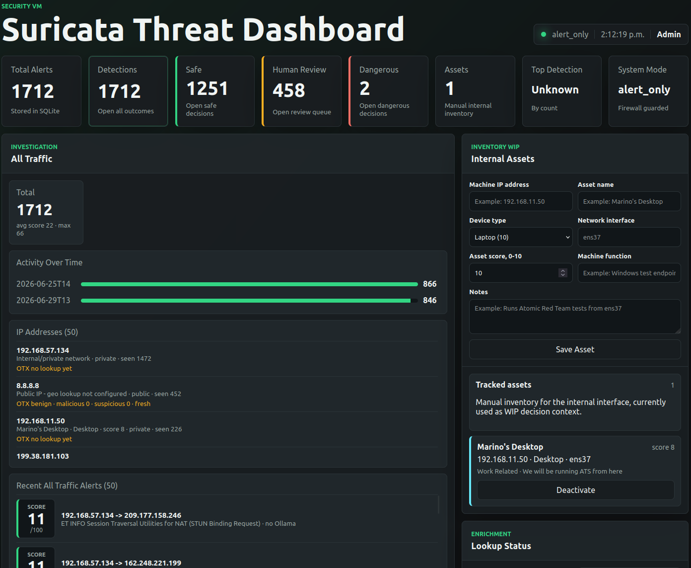
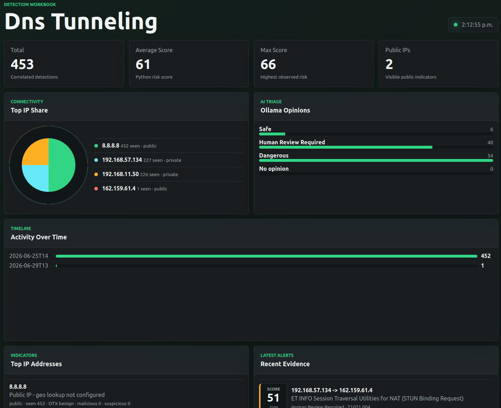
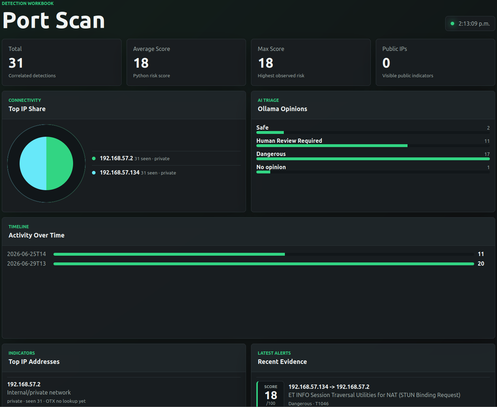
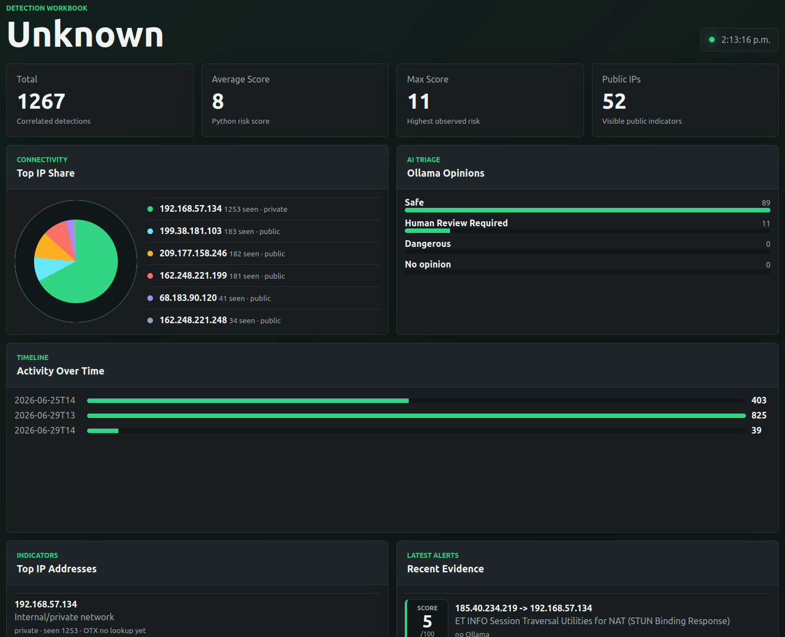
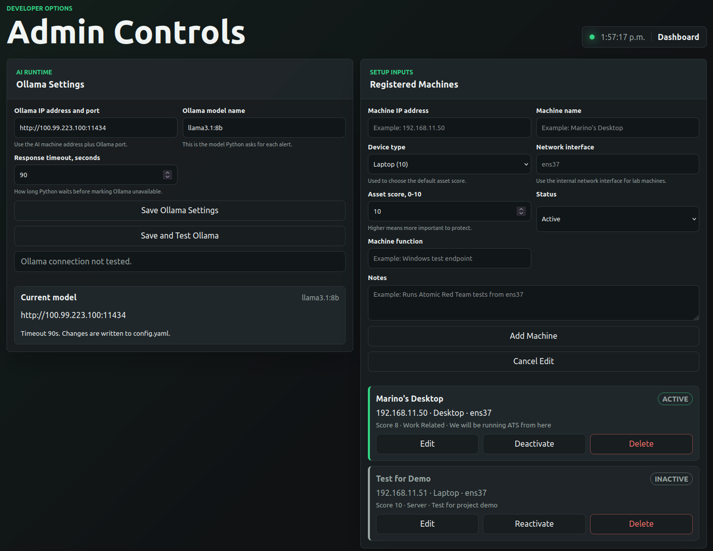
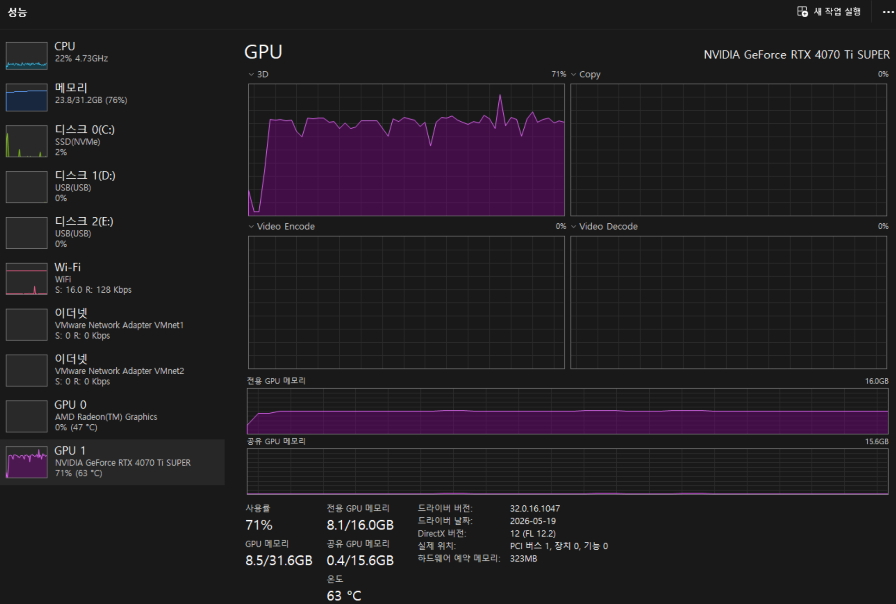

# Security VM

Security VM is an Ubuntu-based security dashboard prototype. It watches Suricata alerts, stores them in SQLite, asks Ollama for a second opinion, records rolling PCAP files, and shows analyst review information in a browser dashboard.

The system starts in safe `alert_only` mode. Ollama can recommend actions, but Python makes the final decision. Firewall blocking is disabled unless `auto_response` is explicitly enabled.

## Screenshots

Main dashboard with Suricata detections, asset tracking, enrichment status, and visible risk scores:



Detection workbooks break down each alert type with IP share, Ollama opinions, timeline, evidence, and recent alerts:







Admin controls let users update Ollama settings, registered machines, asset status, and local tool checks:



Home Ollama/GPU usage during AI triage with an NVIDIA GeForce RTX 4070 Ti SUPER:



## What It Shows

- Latest Suricata alerts
- Detection types and investigation drilldowns
- Dedicated detection workbook tabs with IP share, Ollama opinion, timeline, evidence, and PCAP views
- Dedicated outcome workbook tabs for Safe, Human Review, and Dangerous decisions
- Ollama opinions for alerts
- Decision evidence: alert data, correlation, score, Ollama reason, and final action
- Related PCAP files by detection time window
- Human-review queue
- Temporary allowlist entries
- Manual internal asset inventory for lab machines on `ens37`
- Admin controls for registered machine IPs, Ollama host/model settings, and installed tool checks
- Runtime logs and enrichment status

## Work In Progress Features

These sections are visible in the dashboard so the project direction can be demonstrated, but they are still being refined.

Asset inventory:

- Add internal machines manually by IP address, name, device type, function, and notes.
- Device type applies a default asset score.
- Current lab target is the internal `ens37` network.
- Asset context is shown in detection detail and decision evidence.
- When alert traffic matches a registered source or destination IP, the asset score is added to Python's initial risk score.
- The matched asset details and applied score are sent to Ollama as analyst-defined context.

Human review tuning:

- Analysts can confirm or override human-review alerts.
- Reviews can be labeled as true positive, false positive, authorized test, or unknown.
- Labels are stored in SQLite for later tuning work.
- The model does not automatically learn from those labels yet.

Threat enrichment:

- Local IP classification works now.
- OTX can be configured from the dashboard and run manually against top public IPs.
- The dashboard can test the OTX API key before running lookups.
- OTX lookup scope can be top 5 public IPs, top 10 public IPs, or all visible public IPs in the current investigation view.
- VirusTotal is still planned as an opt-in external lookup.
- API keys must be entered locally in `config.yaml` and must not be committed to GitHub.
- Lookups should be cached in SQLite so the project does not burn API quota.
- Ollama should receive enrichment summaries from Python; Ollama should not call external APIs directly.
- IP address drilldowns show cached OTX results when present, or `OTX no lookup yet` before live lookup support is enabled.

Dashboard reset:

- The Runtime panel has a reset control for clearing dashboard history during demos.
- Reset clears alerts, detections, Ollama reports, responses, review queue, evidence, runtime logs, and cached threat-intel rows.
- Reset keeps manual assets, allowlist entries, and local configuration.

Admin controls:

- Open `/admin` from the dashboard header.
- Change the Ollama host, model name, and timeout without editing `config.yaml` manually.
- Suggested model names include `llama3.1:8b`, `llama3.2:latest`, and DeepSeek options for future testing.
- View and edit registered internal machine IP addresses stored in SQLite.
- Mark assets inactive to preserve tracking history, or permanently delete mistaken entries from admin controls.
- View required system tools and Python packages detected on the Security VM, including version numbers when available.
- Copy install or update commands from the admin page. Run system package commands in the terminal because they usually require `sudo`.
- If `dumpcap` is installed but marked permission-limited, add the user to the `wireshark` group or run packet capture with sudo.

## Prerequisites

Recommended OS:

```text
Ubuntu 20.04 or newer
```

Required system tools:

```text
python3
python3-venv
python3-pip
suricata
suricata-update
sqlite3
wireshark-common
tshark
dumpcap
curl
```

Optional tools / work in progress:

```text
tailscale      needed if Ollama is reached over Tailscale
firewalld      needed only for auto_response firewall blocking
git            needed for cloning and branch workflow
```

These are not required for the basic dashboard, ingest, SQLite storage, and Suricata alert viewing flow. Treat optional integrations as work in progress unless the README section for that feature says otherwise.

Install common Ubuntu dependencies:

```bash
sudo apt update
sudo apt install python3 python3-venv python3-pip sqlite3 curl suricata suricata-update wireshark-common tshark
```

## Installed By Python

These packages are installed by:

```bash
pip install -r requirements.txt
```

Current Python packages:

```text
fastapi     dashboard API framework
uvicorn     web server for the dashboard
PyYAML      config.yaml parsing
requests    Ollama and HTTP API calls
```

FastAPI also installs supporting packages such as `pydantic` and `starlette`.

Everything else imported by the app, such as `sqlite3`, `json`, `ipaddress`, `argparse`, `pathlib`, `datetime`, and `subprocess`, comes from the Python standard library.

Python version:

```text
Python 3.8 or newer
```

Check:

```bash
python3 --version
```

## Quick Start

Clone and enter the project:

```bash
git clone https://github.com/chlee31/security-vm.git
cd security-vm
```

Create the Python environment:

```bash
python3 -m venv venv
source venv/bin/activate
pip install -r requirements.txt
```

Run bootstrap:

```bash
python -m app.bootstrap
```

Bootstrap creates `config.yaml`, initializes `security_vm.db`, checks required tools, and tests the Ollama endpoint.

## Run The System

Use separate terminals for now.

Terminal 1: start or watch Suricata

```bash
sudo systemctl restart suricata
sudo journalctl -u suricata -f
```

Terminal 2: start ingest

```bash
cd ~/Documents/security-vm
source venv/bin/activate
sudo ./venv/bin/python -m app.main ingest --config config.yaml
```

Use `sudo ./venv/bin/python`, not `sudo python`, so sudo still uses the project virtual environment.

Terminal 3: start dashboard

```bash
cd ~/Documents/security-vm
source venv/bin/activate
python -m app.main dashboard --config config.yaml --host 0.0.0.0 --port 8000
```

Open:

```text
http://127.0.0.1:8000/
```

From another machine, use:

```text
http://<security-vm-ip or Tailscale IP address>:8000/
```

Admin controls:

```text
http://<security-vm-ip>:8000/admin
```

Terminal 4: start rolling PCAP capture

```bash
cd ~/Documents/security-vm
chmod +x scripts/start_pcap_capture.sh
./scripts/start_pcap_capture.sh ens33 ens37 /var/log/pcap
```

This records:

```text
ens33 -> external capture
ens37 -> internal capture
```

## Test It

Generate simple traffic:

```bash
ping 8.8.8.8
```

Watch Suricata output:

```bash
sudo tail -f /var/log/suricata/eve.json
```

If ingest is running, alerts should appear in SQLite and on the dashboard.

## Suricata Setup

Check network interfaces:

```bash
ip -br link
```

Current lab interface convention:

```text
ens33  external network
ens37  internal network
```

Check active Suricata rules:

```bash
sudo grep -n -A 20 -B 5 "rule-files:" /etc/suricata/suricata.yaml
```

Expected default-rule setup:

```yaml
default-rule-path: /var/lib/suricata/rules

rule-files:
  - suricata.rules
```

Update default rules:

```bash
sudo suricata-update
```

Test and restart Suricata:

```bash
sudo suricata -T -c /etc/suricata/suricata.yaml
sudo systemctl restart suricata
sudo systemctl status suricata
```

If Suricata complains about `eth0`, edit `/etc/suricata/suricata.yaml` and use the real interface names:

```yaml
af-packet:
  - interface: ens33
  - interface: ens37
```

## Ollama Setup

Ollama should be reachable from the Security VM over Tailscale:

```text
http://<tailscale-ip>:11434
```

Test it:

```bash
curl http://<tailscale-ip>:11434/api/tags
```

The default model used during development:

```text
llama3.2:latest
```

Ingest asks Ollama for an opinion on every normalized Suricata alert. If Ollama is unavailable, the alert is still stored and the dashboard records the failure.

## Useful Commands

Initialize or repair the SQLite schema:

```bash
./venv/bin/python -c "from app.database import init_db; conn = init_db('security_vm.db'); conn.close()"
```

Backfill missing Ollama reports:

```bash
python -m app.main ollama-backfill --config config.yaml --limit 500
```

Check Python syntax:

```bash
./venv/bin/python -m compileall app
```

Check PCAP files:

```bash
sudo ls -lh /var/log/pcap
```

## Common Problems

### Suricata keeps restarting

Check logs:

```bash
sudo journalctl -u suricata -n 80 --no-pager
```

If you see `eth0: No such device`, Suricata is listening on the wrong interface. Use:

```bash
ip -br link
```

Then update `/etc/suricata/suricata.yaml`.

### Ingest cannot read eve.json

Run ingest with the virtualenv Python under sudo:

```bash
sudo ./venv/bin/python -m app.main ingest --config config.yaml
```

### Dashboard shows no alerts

Check these:

```bash
sudo systemctl status suricata
sudo tail -f /var/log/suricata/eve.json
sudo ./venv/bin/python -m app.main ingest --config config.yaml
```

Also confirm dashboard and ingest use the same `database.path` in `config.yaml`.

### Dashboard API says no such table

Initialize the database:

```bash
./venv/bin/python -c "from app.database import init_db; conn = init_db('security_vm.db'); conn.close()"
```

## Project Layout

```text
security-vm/
  app/                         Python backend
  rules/local.rules            Optional local Suricata rules
  scripts/start_pcap_capture.sh Rolling PCAP capture helper
  sql/schema.sql               SQLite schema
  static/                      Dashboard frontend
  config.yaml.example          Example config
  requirements.txt             Python dependencies
```

## Safety Notes

- Default mode is `alert_only`.
- Python makes final decisions.
- Ollama does not execute firewall actions.
- Raw PCAP files are not sent to Ollama.
- Alerts and evidence are stored before any action.
- Allowlist and safelist checks happen before blocking.
- Temporary firewall blocks should only happen in explicit `auto_response` mode.

## Current Limitation

The system still runs as multiple terminal processes. A future launcher should start Suricata checks, PCAP capture, ingest, and dashboard with one command.

Anything not listed in the main run flow should be treated as work in progress until it is documented here with setup and test steps.

## README Rule

When adding or pulling new features, update this README if the change affects:

- setup steps
- required packages
- config values
- run commands
- dashboard behavior
- troubleshooting
- safety behavior

This keeps the repo usable for teammates who clone it fresh.
