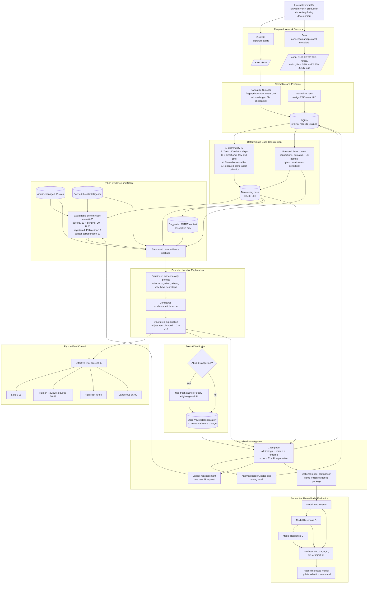

# Security VM Workflow

Security VM is a passive, AI-assisted network investigation platform. This diagram shows how live sensor records become an analyst-reviewed case.

## Correlation Boundary

Community ID represents one bidirectional flow. A larger incident can span many Community IDs, so Security VM also groups repeated behavior conservatively:

- scans may share a source, protocol, and time window while destinations or ports vary;
- DNS tunneling, beaconing, and brute-force activity must share the source plus a relevant destination within the configured window;
- unknown findings require the same source, destination, protocol, and finding name;
- unrelated surrounding Zeek traffic is excluded from case context.

The default correlation policy is versioned as `correlation-v1`. Its current windows are design parameters rather than learned values:

| Parameter | Default | Purpose |
| --- | ---: | --- |
| Cross-sensor flow tolerance | 10 seconds | Allows nearby Suricata and Zeek records to describe one flow when stronger identifiers are absent |
| Same-sensor behavior window | 300 seconds | Groups repeated behavior without creating an unlimited incident window |
| Zeek context window | 120 seconds | Bounds supporting protocol metadata around a case |

Stored correlation values are **rule strengths**, not calibrated probabilities. Community ID receives the strongest value, followed by Zeek UID, flow/time, shared observables, and repeated same-sensor behavior. The windows and strengths must be evaluated through boundary, sensitivity, missed-correlation, and incorrect-merge tests before they can be presented as empirically validated.

## Suricata Recovery and Deduplication

Suricata ingestion stores the EVE file path, inode, and last acknowledged byte offset in SQLite. A record is acknowledged only after case assessment completes. On restart, the reader resumes at that offset. It detects inode changes and same-inode truncation so a replacement EVE file is read from its beginning.

Each normalized Suricata event also receives a SHA-256 fingerprint of canonical event JSON. A partial unique index prevents replayed content from creating a second alert row. On a first installation with no checkpoint, `suricata.start_position` controls whether historical content is read; the safe default is `end`.

## Detection Labels

Detection type is a conservative, rule-based label used for grouping and display. Explicit patterns identify port scanning, DNS tunnelling, beaconing/C2, and brute force. Generic words such as `DNS`, `SYN`, `login`, or `SSH` do not establish those behaviors and remain `unknown`. These labels are not a trained classifier and should be evaluated against labelled Suricata and Zeek scenarios.

## Scoring Interpretation

The five-category policy is versioned as `deterministic-score-v2` and has a maximum of 80 points. MITRE ATT&CK mappings remain descriptive context because they are derived from the existing behavior label rather than independent evidence. The score is an investigation-priority and evidence-strength heuristic, not a probability of compromise. Category maxima and the policy version are stored with each score breakdown. The current weights and outcome thresholds require sensitivity, ablation, and analyst-review evaluation before they can be described as validated.

## Sensor Responsibilities

| Source | Can start a case? | Contribution |
| --- | ---: | --- |
| Suricata `alert` | Yes | Signature, category, severity, flow and Community ID |
| Zeek `notice.log` | Yes | Behavioral or policy finding |
| Zeek protocol logs | Normally no | Connection, DNS, HTTP, TLS/certificate, file, SSH and timing context |
| Zeek `weird.log` | Context by default | Protocol anomaly that needs corroboration |
| Cached threat intelligence | No | Supporting indicator evidence and deterministic score input |
| VirusTotal | No | Post-AI verification only; zero score points |
| Registered IP roles | No | Analyst-defined business impact and traffic direction |

## Evidence Boundaries

- Python owns correlation, the deterministic score, classification thresholds, and the recorded outcome.
- The AI model supplies a bounded adjustment and explanation; it does not execute a response.
- Model comparison runs three requests sequentially against the same evidence. Candidate outputs remain advisory and cannot change the official case decision.
- All three model identities and responses appear directly on the investigation page. Analyst selections update the aggregate scorecard.
- Network evidence cannot establish endpoint process, user identity, or decrypted payload content unless another source explicitly supplies it.
- API keys are not included in prompts, logs, evidence responses, or dashboard payloads.
- The dashboard binds to localhost by default. A remote management address must be selected deliberately.
- Development routing/NAT is only a lab traffic-visibility method; passive SPAN/mirror traffic is the intended deployment.
