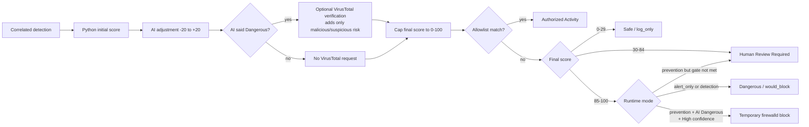

# Security VM Workflow

This document shows how the Security VM currently works from installation through detection, AI-assisted triage, analyst review, and response.

> Open this file in GitHub or use **Markdown: Open Preview** in VS Code to render the Mermaid diagrams.

## End-to-End System

```mermaid
flowchart TB
    USER([Administrator / analyst])
    DEVICE[Internal devices<br/>example: 192.168.11.0/24]
    INTERNET[(External network / Internet)]

    subgraph SETUP[1. Bootstrap and Configuration]
        BOOT[python -m app.bootstrap]
        OS[Detect Ubuntu version<br/>Zeek recommended on 22.04+]
        IFACES[Discover network interfaces<br/>choose internal and external]
        ROUTERSETUP[Optional router setup<br/>netplan + IPv4 forwarding<br/>firewalld zones + masquerade]
        INSTALL[Install/check Python, Suricata,<br/>Zeek, tshark/dumpcap, firewalld]
        ZKG[Optional reviewed Zeek packages<br/>simple scan + anomalous DNS]
        CONFIG[Write local config.yaml<br/>paths, interfaces, AI, modes]
        DBINIT[(Initialize/migrate SQLite)]

        BOOT --> OS --> IFACES
        IFACES --> ROUTERSETUP
        IFACES --> INSTALL --> ZKG
        ROUTERSETUP --> CONFIG
        ZKG --> CONFIG --> DBINIT
    end

    subgraph NETWORK[2. Network and Sensors]
        ROUTER[Security VM router/firewall<br/>internal interface to external interface]
        SURICATA[Suricata<br/>signature IDS alerts]
        EVE[/EVE JSON<br/>alert events/]
        ZEEK[Zeek<br/>behavior and protocol metadata]
        ZLOGS[/JSON logs<br/>notice, conn, DNS, SSL,<br/>HTTP, files, weird, SSH, X.509/]
        CAPTURE[Rolling packet capture<br/>internal + external interfaces]
        PCAPS[/Local PCAP files/]

        DEVICE -->|routed traffic| ROUTER --> INTERNET
        ROUTER -. observable traffic .-> SURICATA --> EVE
        ROUTER -. observable traffic .-> ZEEK --> ZLOGS
        ROUTER -. observable traffic .-> CAPTURE --> PCAPS
    end

    subgraph STARTUP[3. One-Command Runtime]
        RUNALL[app.main run-all]
        CHECKS[Initialize DB once<br/>check/start Suricata and Zeek]
        WORKERS[Managed processes<br/>PCAP capture, Suricata ingest,<br/>Zeek ingest, threat-intel worker,<br/>dashboard API]

        RUNALL --> CHECKS --> WORKERS
    end

    subgraph INGEST[4. Ingest, Normalize, and Correlate]
        SNORM[Normalize Suricata alert]
        ZNORM[Normalize all Zeek logs]
        ZNOTICE{Zeek notice?}
        ZCONTEXT[Store as supporting context]
        CORRELATE[Correlate detections<br/>Community ID first<br/>then bidirectional flow + time]
        FINDINGS[(Detection + separate<br/>sensor findings in SQLite)]
        TRIGGER{Meaningful finding from<br/>Suricata or Zeek?}

        EVE --> SNORM --> CORRELATE
        ZLOGS --> ZNORM --> ZNOTICE
        ZNOTICE -->|yes| CORRELATE
        ZNOTICE -->|no| ZCONTEXT
        CORRELATE --> FINDINGS --> TRIGGER
    end

    subgraph PREAI[5. Deterministic Evidence Before AI]
        PYTHON[Python initial risk score<br/>severity + behavior + MITRE<br/>direction + registered asset score]
        ASSETS[(Registered asset inventory)]
        FEEDS[Scheduled threat-intel feeds<br/>ThreatFox, URLhaus, SSLBL,<br/>Spamhaus, OpenPhish, IPsum,<br/>Feodo and OTX cache]
        TICACHE[(Normalized threat-intel cache)]
        MATCH[Match source, destination,<br/>domains, URLs, and hashes]
        ZWINDOW[Related Zeek context<br/>around detection time and IPs]
        PCAPSELECT[Select PCAP time window<br/>and up to configured file limit]
        TSHARK[tshark converts selected packets<br/>into a small text summary]
        PACKAGE[Unified evidence package<br/>sensor findings + score + asset<br/>MITRE + threat intel + Zeek<br/>packet metadata/text summary]

        TRIGGER -->|yes| PYTHON
        ASSETS --> PYTHON
        FEEDS --> TICACHE --> MATCH
        FINDINGS --> ZWINDOW
        PCAPS --> PCAPSELECT --> TSHARK
        PYTHON --> PACKAGE
        MATCH --> PACKAGE
        ZWINDOW --> PACKAGE
        TSHARK --> PACKAGE
    end

    subgraph AI[6. AI Second Opinion]
        PROFILE[(Selected AI profile<br/>provider, model, endpoint, UID)]
        PROMPT[Versioned cybersecurity prompt<br/>bounded adjustment: -20 to +20]
        MODEL[Configured AI service<br/>Ollama-compatible local/remote model]
        REPORT[Structured JSON result<br/>classification, confidence,<br/>adjustment, reason, action]
        AUDIT[(AI report audit data<br/>profile UID, model run ID,<br/>prompt hash, timing)]

        PACKAGE --> PROMPT
        PROFILE --> PROMPT --> MODEL --> REPORT --> AUDIT
    end

    subgraph POSTAI[7. Post-AI Verification and Final Decision]
        ISDANGER{AI classification<br/>is Dangerous?}
        VT[Query/cache VirusTotal<br/>for public source/destination IPs]
        NOVT[Skip VirusTotal]
        DECIDE[Python decision engine<br/>initial score + AI adjustment<br/>+ malicious/suspicious VT adjustment]
        ALLOW{IP allowlisted?}
        AUTH[Authorized Activity]
        CLASSIFY{Final score and mode gate}
        SAFE[Safe<br/>log_only]
        REVIEW[Human Review Required<br/>pending analyst review]
        DANGER[Dangerous<br/>would_block or temporary_block]

        REPORT --> ISDANGER
        ISDANGER -->|yes| VT --> DECIDE
        ISDANGER -->|no| NOVT --> DECIDE
        PYTHON --> DECIDE
        DECIDE --> ALLOW
        ALLOW -->|yes| AUTH
        ALLOW -->|no| CLASSIFY
        CLASSIFY --> SAFE
        CLASSIFY --> REVIEW
        CLASSIFY --> DANGER
    end

    subgraph RESPONSE[8. Storage, Response, and Notification]
        STORE[(SQLite system of record<br/>alerts, Zeek events, detections,<br/>sensor findings, AI reports,<br/>responses, reviews, threat intel)]
        MODE{System mode}
        ALERTONLY[alert_only<br/>record decision only]
        DETECT[detection<br/>queue dangerous candidate<br/>for analyst enforcement]
        PREVENT[prevention + Dangerous<br/>High AI confidence + score threshold]
        FIREWALL[Temporary firewalld block<br/>record rule and history]
        EMAIL[Gmail notification<br/>Dangerous only when enabled<br/>with duplicate cooldown]

        AUTH --> STORE
        SAFE --> STORE
        REVIEW --> STORE
        DANGER --> STORE
        DANGER --> MODE
        MODE --> ALERTONLY
        MODE --> DETECT
        MODE --> PREVENT --> FIREWALL --> STORE
        DANGER -. optional .-> EMAIL --> STORE
    end

    subgraph UI[9. Dashboard and Analyst Loop]
        DASH[Main dashboard<br/>manual Refresh]
        LATEST[Latest Alerts<br/>unified Suricata + Zeek findings]
        EVIDENCE[Decision Evidence<br/>timestamp, sensors, score,<br/>AI reason, final action]
        INVESTIGATE[Investigation<br/>full event, Zeek context,<br/>threat intel, feedback]
        WORKBOOKS[Detection and outcome workbooks<br/>IP share, timeline, AI opinions]
        IPPAGE[IP investigation<br/>related alerts + provider results]
        COMPARE[AI comparison<br/>profile UID and model runs]
        ADMIN[Admin<br/>assets, allowlist, AI profiles,<br/>threat intel, mode, firewall,<br/>email, tools and sensor status]
        FEEDBACK[Analyst feedback<br/>confirm/override score and decision<br/>label + notes + analyst identity]
        IR[Incident response<br/>enforce, unblock, mark safe,<br/>preserve evidence]

        STORE --> DASH
        DASH --> LATEST
        DASH --> EVIDENCE
        DASH --> WORKBOOKS
        LATEST --> INVESTIGATE
        EVIDENCE --> INVESTIGATE
        INVESTIGATE --> IPPAGE
        STORE --> COMPARE
        STORE --> ADMIN
        INVESTIGATE --> FEEDBACK --> STORE
        ADMIN --> IR
        IR --> FIREWALL
        IR --> STORE
    end

    USER --> BOOT
    USER --> RUNALL
    USER --> DASH
    USER --> ADMIN
    DBINIT --> RUNALL
    WORKERS -. starts / monitors .-> SURICATA
    WORKERS -. starts / monitors .-> ZEEK
    WORKERS -. starts / monitors .-> CAPTURE
    WORKERS -. starts .-> FEEDS
    WORKERS -. serves .-> DASH
    FINDINGS --> STORE
    ZCONTEXT --> STORE
    TICACHE --> STORE
    AUDIT --> STORE

    classDef setup fill:#17324d,stroke:#60a5fa,color:#ffffff;
    classDef sensor fill:#163b35,stroke:#34d399,color:#ffffff;
    classDef process fill:#2d2f45,stroke:#a78bfa,color:#ffffff;
    classDef decision fill:#49361c,stroke:#fbbf24,color:#ffffff;
    classDef danger fill:#4a2025,stroke:#f87171,color:#ffffff;
    classDef data fill:#252b33,stroke:#94a3b8,color:#ffffff;
    classDef ui fill:#253b28,stroke:#4ade80,color:#ffffff;

    class BOOT,OS,IFACES,ROUTERSETUP,INSTALL,ZKG,CONFIG,CHECKS,RUNALL setup;
    class ROUTER,SURICATA,ZEEK,CAPTURE,SNORM,ZNORM,ZCONTEXT sensor;
    class CORRELATE,PYTHON,MATCH,ZWINDOW,PCAPSELECT,TSHARK,PACKAGE,PROMPT,MODEL,REPORT,DECIDE process;
    class ZNOTICE,TRIGGER,ISDANGER,ALLOW,CLASSIFY,MODE decision;
    class DANGER,PREVENT,FIREWALL danger;
    class DBINIT,EVE,ZLOGS,PCAPS,FINDINGS,ASSETS,FEEDS,TICACHE,PROFILE,AUDIT,STORE data;
    class DASH,LATEST,EVIDENCE,INVESTIGATE,WORKBOOKS,IPPAGE,COMPARE,ADMIN,FEEDBACK,IR ui;
```

## Final Decision Gate

The score ranges above reflect the default configuration. Administrators can change the thresholds in `config.yaml`.

## Sensor Responsibilities

| Source | Starts a detection? | Main contribution |
|---|---:|---|
| Suricata `alert` | Yes | Signature/category, priority, flow, Community ID |
| Zeek `notice.log` | Yes | Behavioral or policy finding |
| Zeek protocol logs | No, by themselves | Connection, DNS, TLS/certificate, HTTP, file, SSH, and X.509 context |
| Zeek `weird.log` | Context by default | Protocol anomaly requiring corroboration |
| Rolling PCAP | No | Local packet evidence and bounded `tshark` text summary |
| Cached threat intelligence | No | Pre-AI reputation matches for observed indicators |
| VirusTotal | No | Post-AI verification only after an AI `Dangerous` classification |
| Registered assets | No | Analyst-defined business impact score and device context |

## Runtime Modes

| Mode | Dangerous result behavior |
|---|---|
| `alert_only` | Records the decision without changing traffic. |
| `detection` | Records a `would_block` decision and lets an analyst enforce or mark it safe. |
| `prevention` | Blocks temporarily only when the score reaches the dangerous threshold and the AI classification is `Dangerous` with `High` confidence. |

## Important Boundaries

- Python owns the final score and action. The AI model provides a bounded second opinion.
- Raw PCAP bytes are kept local. Only selected packet metadata and compact `tshark` text summaries can enter the prompt.
- Encrypted payloads are not decrypted. The system reasons from visible network metadata, sensor findings, TLS/DNS clues, timing, volume, reputation, and asset context.
- Threat-intelligence feeds are fetched by Python. The AI model does not browse the Internet or call provider APIs.
- Analyst reviews are preserved in SQLite for audit and future tuning. They do not currently retrain Python or the AI model automatically.
- AI profile UID, model identity, model-run ID, prompt version/hash, and response timing support comparisons between models.
