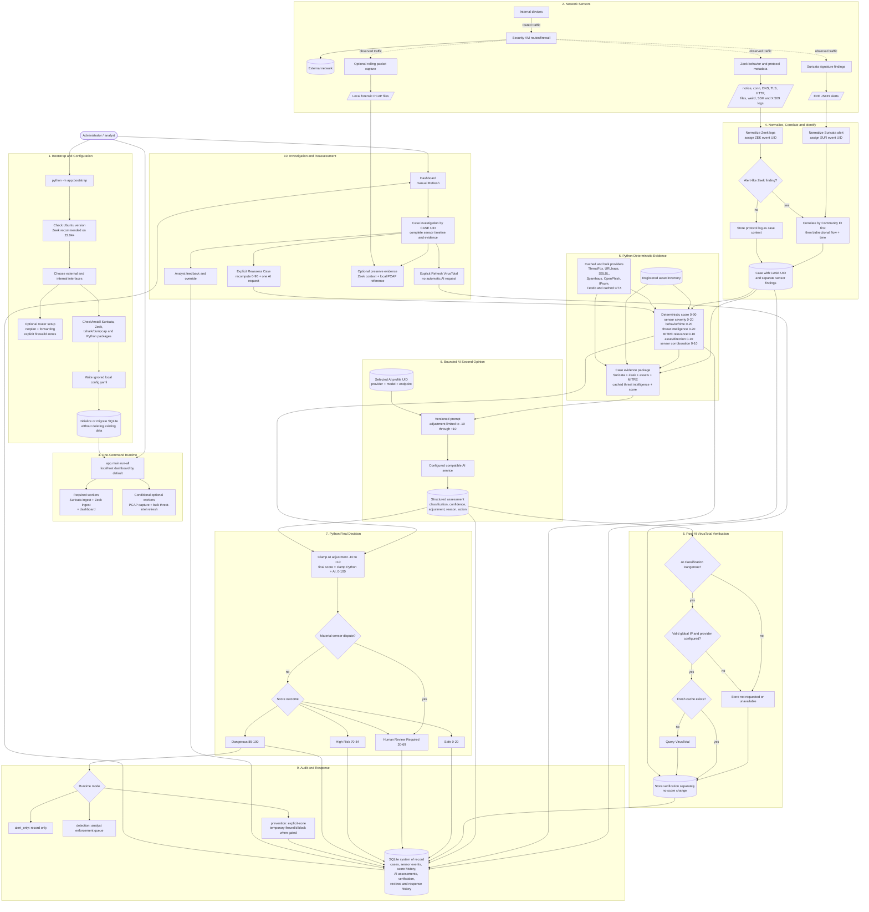
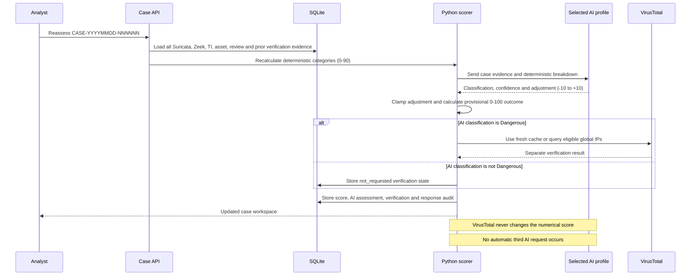

# Security VM Workflow

This document shows the current path from network sensors to a case, deterministic scoring, AI-assisted triage, optional VirusTotal verification, analyst reassessment, and response.

> Open this file in GitHub or use **Markdown: Open Preview** in VS Code to render the Mermaid diagrams.

## End-To-End System

## Reassessment Sequence

## Sensor Responsibilities

| Source | Starts a case? | Main contribution |
|---|---:|---|
| Suricata `alert` | Yes | Signature, category, priority, flow and Community ID |
| Zeek `notice.log` | Yes | Behavioral or policy finding |
| Zeek protocol logs | No, by themselves | Connection, DNS, TLS/certificate, HTTP, file, SSH and X.509 context |
| Zeek `weird.log` | Context by default | Protocol anomaly requiring corroboration |
| Rolling PCAP | No | Optional local forensic preservation; never sent in AI prompts |
| Cached/bulk threat intelligence | No | Pre-AI indicator matches and up to 20 deterministic points |
| VirusTotal | No | Post-AI verification only; zero score points |
| Registered assets | No | Analyst-defined business impact and traffic-direction context |

## Security Boundaries

- Python owns the deterministic score, final classification, and response action.
- The AI model supplies only a bounded `-10` to `+10` adjustment and explanation.
- A materially disputed sensor finding forces Human Review Required.
- VirusTotal no-detection results never lower a classification.
- Private, loopback, link-local, multicast, reserved, and `100.64.0.0/10` addresses are never queried through VirusTotal.
- API keys, Gmail app passwords, and raw PCAP data are not sent to the AI model or returned in dashboard evidence.
- PCAP collection is optional and remains local for explicit forensic preservation.
- The dashboard binds to localhost by default. Binding to `0.0.0.0` is an explicit, warned lab-only choice.
- firewalld commands always specify the configured zone.
